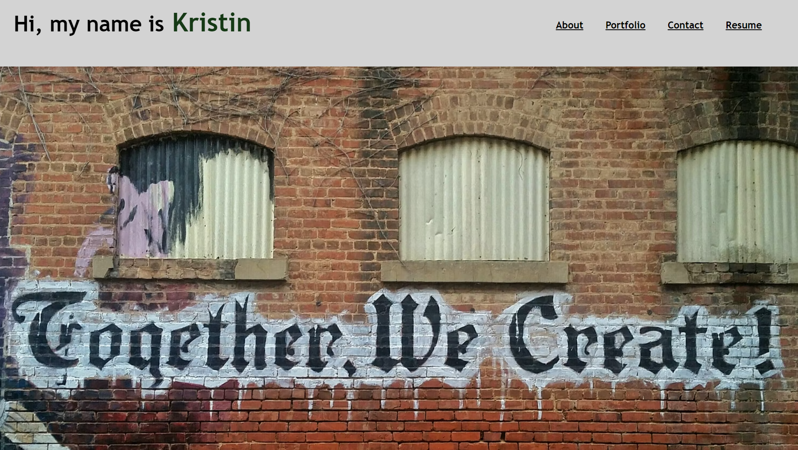

# KLweb
Advanced CSS - Coding Challenge 

# Description
This is code for my personal portfolio. 

# Portfolio screenshot 

# Github: 
git@github.com:Lynchk07/KLweb.git

# Website: 

 # Future Updates
 
 Add customer contact information form 

 
 Add links to projects that navigate to a new window from the gallery links 

 
 Link to about me webpage from the gallery "about me" link.
